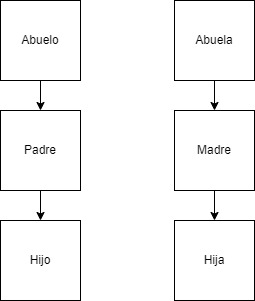

<h1 align="center "># Taller I (Linux 1)</h1>

<b>Ivan Andres Guapacha</b>

## 1. Dirigirse al /home/user del usuario creado y con los comandos anteriormente vistos en clase, crear la siguiente estructura de directorios

Para esto lo primero que debebemos hacer es ir a nuestro home y empezar a crear las carpetas desde abuelo hasta hijo

Hacemos lo mismo pero en este caspo para las carpetas abuela hasta hija

## 2. Ingresar a cada directorio y crear un archivo a través de CLI o consola este archivo debe contener la siguiente información:
## Nombres: 
## Apellidos:
## Estatura:
## RH:

con el comando cd no dirigimos hasta la carpeta abuelo y alli con el comando vi [nombre archivo] creamos el archivo de texto para Jair

Cuando ejecutemos el  comando vi Jair se nos abrira el editor de archivos Vi alli precionamos la tecla i para poder modificar el archivo, modificamos el archivo y para salir precinamos esc y luego wq para indicar que vamos a guardar el archivo y salir

Este mismo procedimiento aplica para el resto de archivo de la estructura solicitada

Archivo Padre

Archivo Hijo

Archivo Abuela

Archivo Madre 

Archivo Hija

## 3. Instalar el paquete "Tree" en cada nivel de directorio ejecutar el comando

Para el direcctorio Abuelo

Para el direcctorio Abuela

