<h1 align="center "># Taller ll (Linux 1)</h1>

<b>Ivan Andres Guapacha</b>

## 1. Cambiar la contraseña del usuario root 

Para cambiar o recuperar la contraseña del usuario root lo primero que debemos hacer es cuando el sistema operativo esta arrancando mover las flechas para cargar la pantalla que nos permite elegir el inicio del sistema operativo y estando en esta pantalla vamos a precionar ctrl + e para modificar 

En esta pantalla vamos a modificar rhgb quiet por  rb.break 

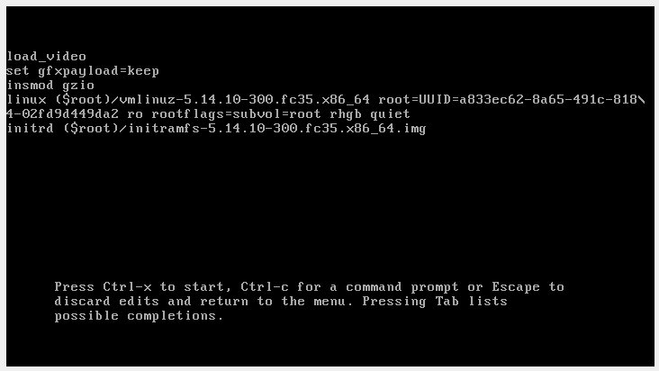

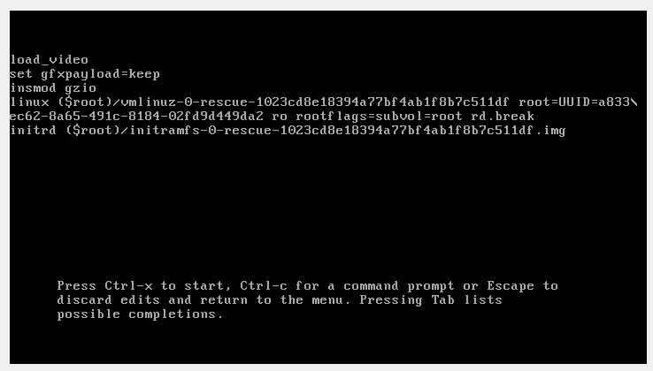

Luego de esto precionamos enter para mantener en la consola

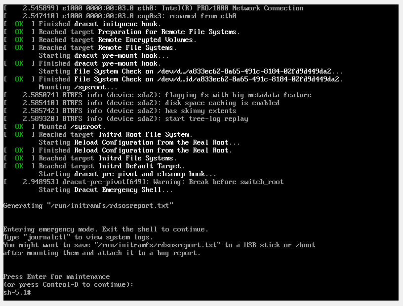

En esta consola ejecutamos el comando mount  y luego ejecutamos el comando mount -o rw,remount /sysroot/

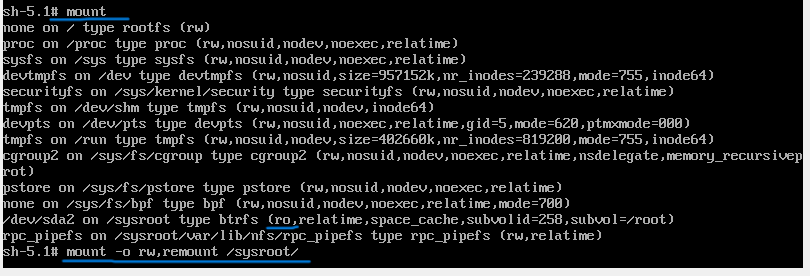

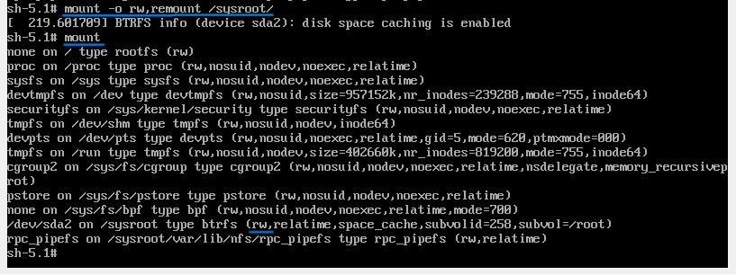

Luego ejecutamos el comando chroot /sysroot y luego passwd para cambiar la contraseña del usuario root

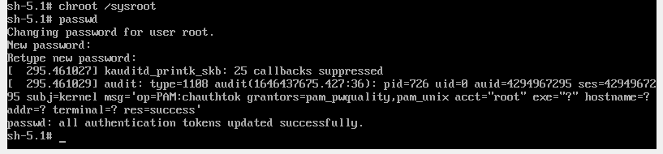

Continuando con el proceso escribimos el comando touch y luego el comando exit

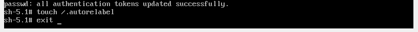

Luego de esto esperamos a que el sistema reinicie y con la contraseña que le pusimos podemos ingresar con el usuario root al sistema 

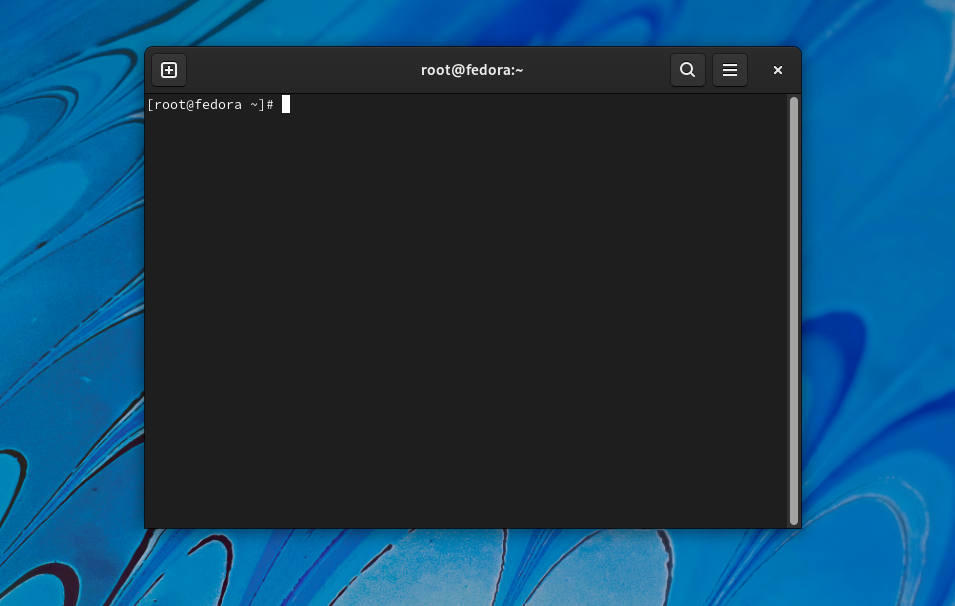

## 2. Modificar el arbol genealogico creado en el taller 1 para agregar las carpetas Bisabuela, Bisabuelo, Nieto y Nieta con sus respectivos archivos txt 

Para esto lo primero que tenemos que hacer es crear las carpetas de Bisabuela y Bisabuelo con el comando mkdir

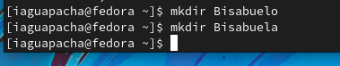

Luego de esto vamos a mover toda la carpeta Abuelo dentro de la carpeta Bisabuelo y tambien la carpeta Abuela la vamos a mover dentro de la carpeta Bisabuela

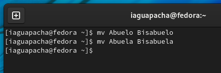

Como paso siguiente vamos a ir hasta La carpeta hija e hijo y vamos a seguir creando el arbol con nieto y bisnieto 

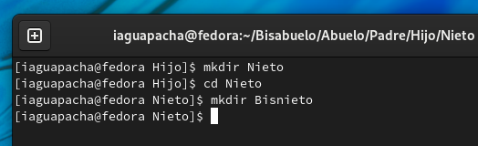

Y tambien vamos a crear los archivos que corresponden a cada carpeta

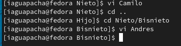

Y esto mismo aplica para la otra rama de hija 

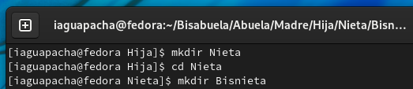

Y tambien los archivos de Bisabuelo y Bisabuela

Ahora si vamos a intercambiar los archivos de las carpetas masculinos para las carpetas feneminas

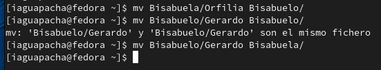

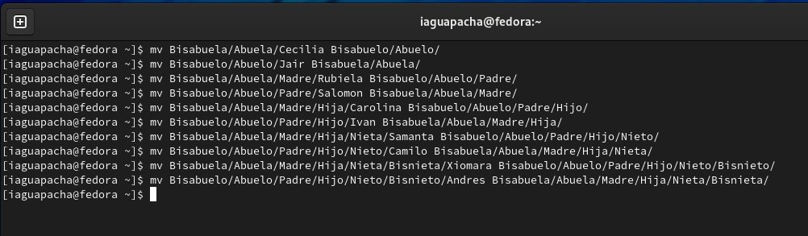

Y como resultado final tenemos lo siguiente:

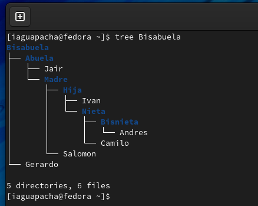

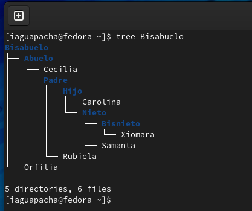

